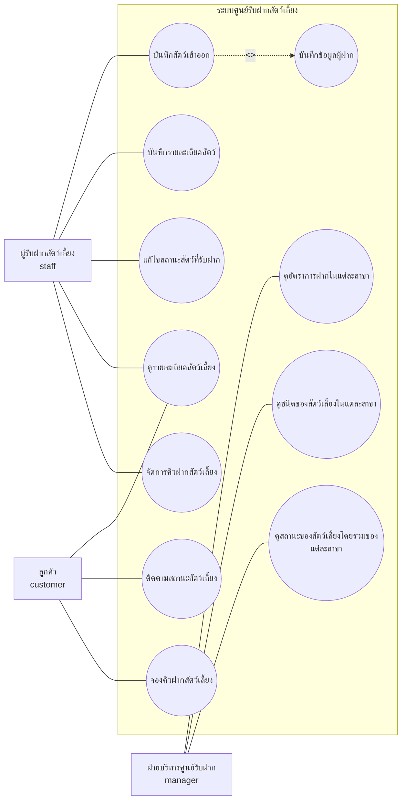

Use Case Diagram

```mermaid
graph LR
    %% Actors
    Customer[ลูกค้า<br/>customer]
    Staff[ผู้รับฝากสัตว์เลี้ยง<br/>staff]
    Manager[ฝ่ายบริหารศูนย์รับฝาก<br/>manager]

    subgraph System ["ระบบศูนย์รับฝากสัตว์เลี้ยง"]
        UC1((บันทึกข้อมูลผู้ฝาก))
        UC2((บันทึกสัตว์เข้าออก))
        UC3((บันทึกรายละเอียดสัตว์))
        UC4((แก้ไขสถานะสัตว์ที่รับฝาก))
        UC5((ดูรายละเอียดสัตว์เลี้ยง))
        UC6((ติดตามสถานะสัตว์เลี้ยง))
        UC7((จองคิวฝากสัตว์เลี้ยง))
        UC8((จัดการคิวฝากสัตว์เลี้ยง))
        UC9((ดูอัตราการฝากในแต่ละสาขา))
        UC10((ดูชนิดของสัตว์เลี้ยงในแต่ละสาขา))
        UC11((ดูสถานะของสัตว์เลี้ยงโดยรวมของแต่ละสาขา))
    end

    %% Relationships - Customer
    Customer --- UC5
    Customer --- UC6
    Customer --- UC7

    %% Relationships - Staff
    Staff --- UC2
    Staff --- UC3
    Staff --- UC4
    Staff --- UC5
    Staff --- UC8

    %% Relationships - Manager
    Manager --- UC9
    Manager --- UC10
    Manager --- UC11

    %% Include Relationship
    UC2 -. "<<include>>" .-> UC1
```